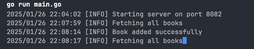

# Rest Api for book shop

[](https://go.dev)
[](LICENSE.txt)

>[!MPORTANT]
> Rest Api - rest api server для магазина книг, который получает такие запросы как:
> `Get`,`Add`,`Delet`,`books`.

>[!TIP] 200 Ok
> Прмер правильного ряда запрсоов
> 1) Тут мы добавляем книгу
> ```shell
> curl -X POST http://localhost:8082/api/v1/books/add \
>   -H "Content-Type: application/json" \
>   -d '{
>       "id": 1,
>       "title": "Пример книги",
>       "author": "Иван Иванов"
>   }'
> 
> 2) Тут мы можем получить лист всех книг
> 
> ```shell
> curl -X GET http://localhost:8082/api/v1/books
> ```
> Ответ
> ```shell
> [{"id":1,"title":"Пример книги","author":"Иван Иванов","price":0}]
> ```

>[!INFO]<br>
> Работа логгера<br>
> 

## Запуск проекта

```shell
cd cmd
go run main.go
```

## Git clone

```shell
git clone https://github.com/golkity/RestApi.git
```